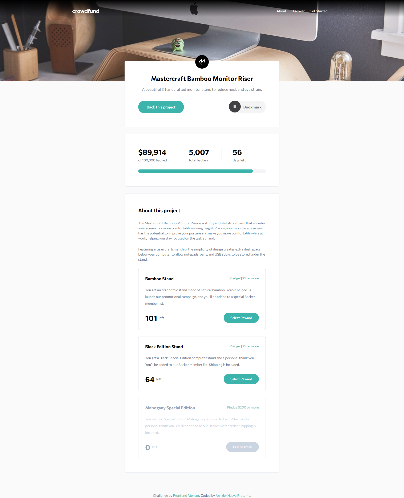

# Frontend Mentor - Crowdfunding product page solution

This is a solution to the [Crowdfunding product page challenge on Frontend Mentor](https://www.frontendmentor.io/challenges/crowdfunding-product-page-7uvcZe7ZR). Frontend Mentor challenges help you improve your coding skills by building realistic projects.

## Table of contents

- [Overview](#overview)
  - [The challenge](#the-challenge)
  - [Screenshot](#screenshot)
  - [Links](#links)
- [My process](#my-process)
  - [Built with](#built-with)
  - [What I learned](#what-i-learned)
  - [Useful resources](#useful-resources)
- [Author](#author)

## Overview

### The challenge

Users should be able to:

- View the optimal layout depending on their device's screen size
- See hover states for interactive elements
- Make a selection of which pledge to make
- See an updated progress bar and total money raised based on their pledge total after confirming a pledge
- See the number of total backers increment by one after confirming a pledge
- Toggle whether or not the product is bookmarked

### Screenshot

[📱 Mobile Version](./mobile.png)

### Links

- 📌 Solution URL: [Solution](https://github.com/arrizkyhp/fm-crowdfunding-product-page)
- 🎪 Live Site URL: [Live Site](https://arrizkyhp.github.io/fm-crowdfunding-product-page/)

## My process

This challenge take long time 🤣 but i learn so much

### Built with

- Semantic HTML5 markup
- Flexbox
- CSS Grid
- [TailwindCss](https://tailwindcss.com/) - CSS framework
- [ReactJS](https://reactjs.org/) - JS library

### What I learned

I learned that you cant put h1,div,p inside label or button, and of course im using tailwindCss for this challenge.

Also im start using Context for this challenge and starting to understand a little bit.

### Continued development

maybe i try adding darkmode???

### Useful resources

- [Modal Select](https://codepen.io/adamstuartclark/pen/pbYVYR) - This helped me for understanding how select in modal project.
- [Passing onChange event from child to parent in React](https://stackoverflow.com/questions/62334342/passing-onchange-event-from-child-to-parent-in-react) - This stackoverflow help me on passing event from child to parent in React.

## Author

- Github - [arrizkyhp](https://github.com/arrizkyhp)
- Frontend Mentor - [@arrizkyhp](https://www.frontendmentor.io/profile/arrizkyhp)
- Twitter - [@arrizkyhp](https://twitter.com/arrizkyhp)
